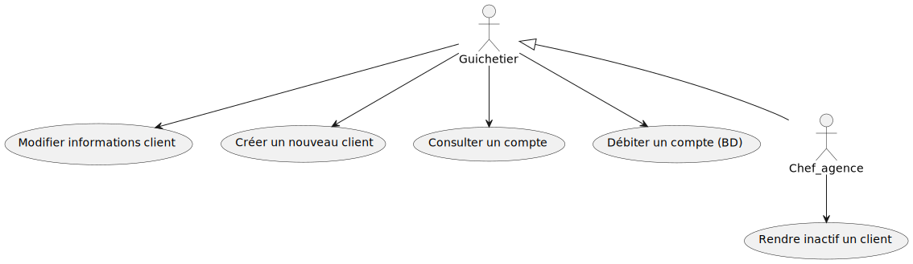

= Cahier des Charges V2 V3
:toc:
:toc-title: Sommaire

Date : 29/03/2022 +
Equipe : Marcq Galatée - Monté Hugo - Tubia Eva +

<<<

== 1. Présentation du projet et mise en contexte
=== a) Contexte
Pour s'adapter aux avancées technologiques, tous les secteurs doivent augmenter leurs ivestissements dans le digital et restructurer leurs services. Les banques doivent notamment proposer la majorité de leurs services à distance via leurs sites ou applications afin d'augmenter leur accéssibilité et interêt auprès des clients. Dans une stratégie de différenciation, il est important pour les banques d'innover et d'effectuer une veille informatique constante afin de développer un avantage concurrentiel sur le marché. De plus, avec la pandémie de Covid-19, les clients ont pris l'habitude de tout faire à distance, sans avoir besoin d'aller en agence consulter un conseiller. De plus, de nouveaux concurrents sont apparus sur le marché : les néo-banques. C'est donc pour répondre aux besoins de leurs clients et pour rester compétitifs que les banques se doivent de proposer des services digitaux efficaces.

=== b) Client +
Daily Bank est un réseau français de 100 agences bancaires. Il est nécessaire pour eux de restructurer leur réseau afin de s'intégrer dans cette stratégie de différenciation. Ils possèdent plusieurs outils qui deviennent obsolètes et une première version d'application qui nécessite une refonte. En effet, les besoins de la banque évoluent, tout comme ceux des clients, il faut donc développer plusieurs fonctinnalités pour répondre à ces besoins. +

=== c) Objectif +
Le but est de partir d'une application existante et d'y rajouter des fonctionnalités. Il y a deux types d'utilisateurs de l'application : le guichetier et le chef d'agence. Les guichetiers pourront créer de nouveaux clients et faire les opérations courantes (Create Read Update Delete). Les chefs d’agences pourront gérer les employés et les opérations exeptionnelles. L'application sera découpée en plusieurs versions (3) à la demande du client. +

== 2. Analyse de l'existant
Une version de l'application existe déjà. Elle comprend des fonctionnalités pour le guichetier :

* Modifier des informations client (adresse, téléphone,...)
* Créer un nouveau client
* Consulter un compte
* Débiter un compte
* Le chef d'agence peut faire tout ce que fait le guichetier, et également rendre inactif un client.

Voici le use case décrivant l'existant :+

Nous vouyons donc sur ce use case 2 utilisateurs principaux : le guichetier et le chef de l'agence. Leur rôle est décrit ci-dessus.

== 3. Besoins
Afin de mener ce projet à bien, il est nécessaire de réaliser une application Java. L'application doit permettre de gérer des comptes bancaires de dépôt, une gestion définie par les fonctionnalités listées ci-dessous, organisées en fonction du poste de l'utilisateur de l'application au sein de la banque. +

* Guichetier +
** Créditer et débiter un compte +
** Créer un compte +
** Effectuer un virement de compte à compte +
** Clôturer un compte +

* Chef d'agence +
** Consulter les employés et pouvoir en créer / modifier / supprimer +

En résumé, un guichetier peut créer un compte, le créditer, le débiter, effectuer un virement depuis celui-ci vers un autre compte ainsi que le côturer. +
Pour ce qui est du chef d'agence, il peut consulter les employées ainsi qu'en créer, supprimer et modifier ceux qui existent déjà.

==== Version 2

* Guichetier
** Générer un relevé mensuel d'un compte en PDF
** Gérer les prélèvements automatiques
* Chef d'Agence (uniquement les spécifications)
** Effectuer un débit exceptionnel
** Simuler un emprunt
** Simuler une assurance d'emprunt

En résumé, à patir de la version 2, le guichetier peut en plus, générer le relevé mensuel d'un compte (format PDF), gérer les prélèvements automatiques (créer un nouveau, modifier/voir/supprimer les existants). +
Pour ce qui est du chef d'agence, les spécifications des fonctionnalités suivantes seront disponibles : effectuer un débit exceptionnel sur un compte, simuler un emprunt ainsi qu'une assurance d'emprunt.

==== Version 3

* Chef d’Agence
** Les spécifications finalisées de la version 2
** Supers options pour les tops …
** Développer une ou plusieurs fonctionnalités au choix et selon vos compétences
* Batch
** Générer les relevés mensuels en PDF
** Exécuter les prélèvements automatiques

En résumé, à partir de la version 3, seront disponibles de nouvelles fonctionnalités. Le chef d'agence peut utiliser les fonctionnalités dont ont été réalisées les spécifications. +
Pour ce qui est du "batch", ses fonctionnalités seront la génération de relevés mensuels (format PDF) et l'exécution des prélèvements automatiques.

== 4. Contraintes 
=== a) Contraintes techniques
Les langages de programmation utilisés sont imposés. L'application déjà existante utilise les langages JAVA (pour les fonctionalités), JavaFX (pour le visuel : l'IHM) et Oracle (pour la base de données). Il s'agira donc d'ajouter de nouvelles fonctionalités avec ces mêmes langages. Aussi, il s'agira de ne pas repartir de zéro par rapport à l'existant. Il faudra donc l'étudier (code Java, Javafx, et la base de données) afin d'ajouter les nouvelles fonctionnalités. +
La maîtrise d'oeuvre (MOE) sera constituée de 3 développeurs : Tubia Eva, Monte Hugo et Marcq Galatée. +
Marcq Galatée a le rôle de chef de projet.

=== b) Contraintes organisationnelles
Une planification a été établie avec le client, avec des dates précises pour chaque rendu. +
Semaine 13 :
[circle]
* Première version du GANTT
* Première version du cahier des charges +

Semaine 16 :
[circle]
* Deuxième et troisième version du GANTT 
* Deuxième et troisième version du cahier des charges
* Première version du cahier des tests +

Semaine 20 : 
[circle]
* Première version du document technique
* Première version du document utilisateur
* Deuxième version du cahier des test
* Mise à jour du GANTT +

Semaine 22 :
[circle]
* Deuxième et troisième version du document technique
* Deuxième et troisième version du document utilisateur
* Troisième version du cahier des tests
* Mise à jour du GANTT +
* Première version d l'application

Semaine 23 :
[circle]
* Deuxième et troisième version de l'application
* Livraison finale des documents
* Chiffrage du projet
* Bilan du projet

== 5. Livrables du projet
=== a) Pour le client
* Cahier des tests v1 v2 v3
* Documentation utilisateur v1 v2 v3
* Chiffrage du projet
* Application (jar)

=== b) Dans le cadre de la SAE
* Gantt v1 v2 v3
* Cahier des charges v1 v2 v3
* Documentation technique v1 v2 v3
