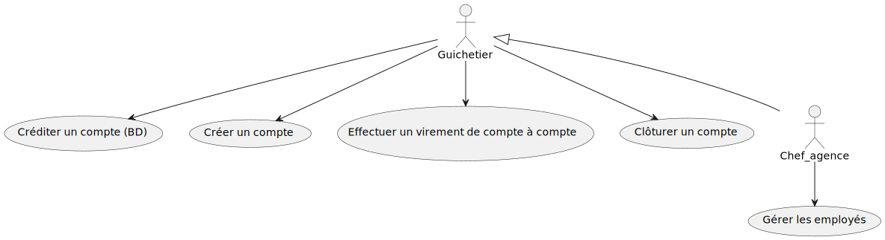
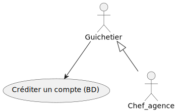
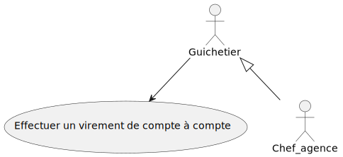
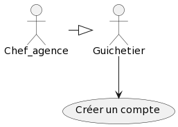
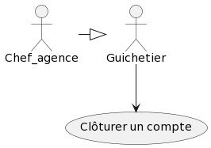
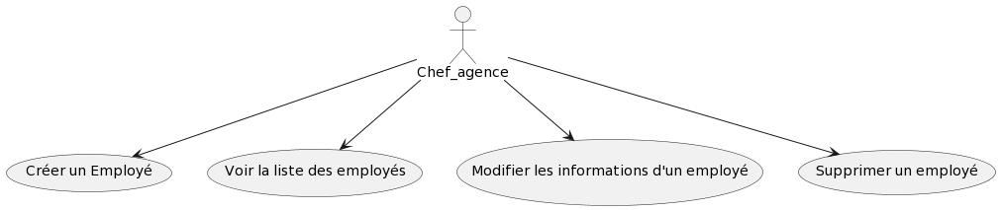

= Dossier d’Analyse et de Conception
:toc:
:toc-title: Sommaire

Version de l'application : 1 +
Date : 20/04/2022 +
Client : BankUniv +
Projet : Daily Bank + 

<<<

== 1. Description du Projet
=== a) Equipe

Conception/Développement : Marcq Galatée - Monté Hugo - Tubia Eva +

.Répartition des tâches et état d'avancement
[options="header,footer"]
|=======================
|version|user     |use case   |fonctionnalité              |   Galatée | Hugo  |   Eva 
|0    |Chef d'Agence    |Client        |Rendre inactif un Client | |F |
|1    |Chef d'Agence    |CRUD employé  |C|F | | 
|1    |Chef d'Agence    |CRUD employé  |R|F | | 
|1    |Chef d'Agence    |CRUD employé  |U|F | | 
|1    |Chef d'Agence    |CRUD employé  |D|F | | 
|1    |Guichetier     | Compte | Créer||F | 
|1    |Guichetier     | Compte | Créditer/Débiter|| |F
|1    |Guichetier     | Compte | Effectuer un virement|| |F 
|1    |Guichetier     | Compte | Clôturer||F | 
|2    |Chef d'Agence     | Compte | Débit exceptionnel|| | 
|2    |Chef d'Agence     | Emprunt | Simuler emprunt|| | 
|2    |Chef d'Agence     | Emprunt | Simuler assurance|| | 
|2    |Guichetier     | Compte | Relevé PDF|| | 
|2    |Guichetier     | CRUD Prélèvement | C|| | 
|2    |Guichetier     | CRUD Prélèvement | R|| | 
|2    |Guichetier     | CRUD Prélèvement | U|| | 
|2    |Guichetier     | CRUD Prélèvement | D|| | 
|2    |Bach     | Prélèvements automatiques | || | 
|2    |Bach     | Relevés mensuels | || | 

|=======================

F pour fonctionnel ou
D pour en Développement

=== b) Contexte du projet

L'entreprise Daily Bank a besoin de restructurer leur réseau afin de s’intégrer dans une stratégie de différenciation. Elle possède plusieurs outils qui deviennent obsolètes et une première version d’application qui nécessite une refonte. Les besoins de la banque ont évolués, tout comme ceux de leurs clients, il faut donc développer plusieurs fonctinnalités pour répondre à ces nouveaux besoins.

=== c) Objectifs du projet

Le but est de générer le fichier executable de l'application (jar), la documentation technique, la documentation utilisateur ainsi que le cahier de tests correpondants à la version de l'application développée. Il y a deux types d’utilisateurs de l’application : le guichetier et le chef d’agence. Les guichetiers pourront créer de nouveaux clients et faire les opérations courantes (Create Read Update Delete). Les chefs d’agences pourront gérer les employés et les opérations exeptionnelles. L’application et les documentations seront découpées en plusieurs versions (3).

== 2. Architecture

=== a) Architecture Générale

L'application sera déployée sur toutes les machines des employés (guichetiers et chefs d'agences) dans toutes les agences.
L'application utilise Java 1.8, JavaFX pour l'interface et se connecte à une base de données Oracle.

=== b) Ressources externes

Le fichier .jar permet l'exécution par l'utilisateur de l'application. Réferrez-vous à la documentation utilisateur pour connaître les différentes fonctionnalités du point de vue de l'utilisateur.
Une base de données Oracle est utilisée par cette application, la connexion est établie dans la classe `LogToDatabase.java`, package "model.orm".

=== c) Structuration en packages

Les packages :

* application +
DailyBank : main() de départ

* application.control + 
Contrôleurs de dialogue et accès aux données : gestion des fonctions de l’application

* application.view +
Vues de l’application - fichiers fxml et contrôleurs associés - : gestion des vues uniquement : affichages, contrôle de saisies, …

* application.tools + 
Utilitaires pour application.view et application.control

* model.data + 
Classes java mappant les table de la BD. Une table ⇒ 1 classe.

* model.orm +
Classes d’accès physiques à la BD. Une table ⇒ 1 classe offrant différentes méthodes pour accéder à la table : select, insert, delete, update, appel de procédure stockée.

* model.exception +
Classes des exceptions spécifiques d’accès à la BD, levées par les classes de model.orm

A chaque page est associée une vue FXML, un controleur de vue et une classe qui lance la page.

== 3. Fonctionnalités
=== a) Version 1

Voici le Use Case général de la version 1 :

==== Créditer un compte (Eva Tubia)

Use case : 

Accessibilité : Guichetier et Chef d'agence +

Action de création d'une opération crédit sur un compte. +
Fonctionnement dans le code : lorsque l'utilisateur clique sur le bouton "Enregistrer crédit ", le contrôleur de vue `OperationsManagementController` transfère les informations nécessaires au contrôle `OperationsManagement`  pour l'affichage de la page. Ensuite, pour enregistrer le crédit, la classe contrôle `OperationEditorPane` est utilisée, elle va afficher la page pour créer l'opération et transmettre les informations au controleur de vue `OperationEditorPaneController`. Les entrées de l'utilisateur sont controlées lorsqu'il tente de valider l'opération, si tout est correct l'opération est créée et le contrôle `OperationsManagement` peut enfin se connecter à la base de données et effectuer l'opération si l'opération n'est pas nulle. L'opération dans la base de données est effectué en utilisant la classe ORM `AccessOperation`. +

Conditions de validation de l'opération : Montant entré non null, positif, correspondant à un entier +

==== Virement de compte à compte (Eva Tubia)

Use case : 

Accessibilité : Guichetier et Chef d'agence +

Action de création d'une opération virement entre deux comptes. +
Fonctionnement dans le code : lorsque l'utilisateur clique sur le bouton "Effectuer un virement ", le contrôleur de vue `OperationsManagementController` transfère les informations nécessaires au contrôle `OperationsManagement`  pour l'affichage de la page. Ensuite, pour enregistrer le virement, la classe contrôle `OperationEditorPane` est utilisée, elle va afficher la page pour créer l'opération et transmettre les informations au controleur de vue `OperationEditorPaneController`. Les entrées de l'utilisateur sont controlées lorsqu'il tente de valider l'opération, si tout est correct deux opérations sont crées, l'une correspondant au compte qui effectue le virement (débit) et l'autre correspondant au compte destinataire (crédit). Ces deux opérations sont transmises au controle `OperationsManagement` qui peut enfin se connecter à la base de données et effectuer les opérations en utilisant la classe ORM `AccessOperation`. +

Conditions de validation de l'opération : Montant entré non null, positif, correspondant à un entier, ne dépassant pas le débit autorisé / Numéro de compte entré non null, existant, non cloturé +

==== Créer un compte (Hugo Monté)

Use case : "Créer un compte"

Action d'insertion du nouveau compte dans cette table. +
Fonctionnement dans le code : le contrôleur de vue ComptesManagement transfère l'information de création (pour ouvrir le menu qui affiche les données à saisir) au contrôle ComptesManagement qui va afficher l'interface puis envoyer l'information de création à l'ORM AccesCompteCourant et renvoyer le résultat après tout ça au contrôleur de vue initial. AccesCompteCourant va appeler CreerCompte dans la base de données.

Informations supplémentaires sur la documentation utilisateur.

==== Clôturer un compte (Hugo Monté)

Use case : "Clôturer un compte"

Action de modification sur cette table de "solde" et de "estCloture" (respectivement 0 et "O"). +
Fonctionnement dans le code : le contrôleur de vue ComptesManagement transfère l'information de clôture au contrôle ComptesManagement qui va envoyer l'information de clôture à l'ORM AccesCompteCourant et renvoyer le résultat après tout ça au contrôleur de vue initial. AccesCompteCourant va modifier "estCloture" de ce compte pour mettre "O" (signifiant oui) ainsi que le solde (remis à 0) dans la base de données.

Informations supplémentaires sur la documentation utilisateur.

==== Gérer (faire le « CRUD ») les employés (guichetier et chef d’agence) (Galatée Marcq)

Use case :

Répartitions des fonctions dans les packages :

* application.control, classe  `EmployeManagement` : + 
** `NouvelEmploye()`
** `supprimerEmploye()`
** `getListeEmploye()` +

* application.control, classe `EmployeEditorPane`:
** `doEmployeEditorDialog()`

* application.view, classe `EmployeManagementController` :
** `doRechercher()`
** `doModifierEmploye()`
** `doSupprimerEmploye()`
** `doNouvelEmploye()`

* application.view, classe `EmployeEditorPaneController` :
** `doAjouter()`
** `isSaisieValide()`

* model.orm, classe AccessEmploye
** `getEmploye()`
** `updateEmploye()`
** `insertEmploye()`
** `deleteEmploye()`

La fenêtre principale de gestion des employés est gérée par la classe `EmployeManagementController`. Dans celle-ci, plusieurs fonctionnalités sont présentes :

* Create = fonction Nouvel employé +

Dans la page principale de gestion des employés, le bouton "Nouvel employé" permet de créer un nouvel employé. Appelle la fonctionnalité `doNouvelEmploye()`. Une nouvelle fenêtre apparait alors afin de remplir les différents attributs de l'employé, fenêtre qui est gérée par la classe `EmployeEditorPaneController`. Lorsque le bouton "ajouter" est cliqué, une vérification des différents champs est effectuée avec la fonction `isSaisieValide()`, puis une connexion avec la base de données est réalisée afin d'insérer l'employé (classe `AccessEmploye`, fonction `insertEmploye()`).
Pour qu'une saisie soit valide il faut qu'aucun des champs ne soient vides, et que les deux mots de passe saisis soient équivalents.

* Read = bouton "Rechercher", liste des employés +

Dans la page principale de gestion des employés, le bouton "Rechercher" permet de rechercher des employés selon certains critères (ou aucun). +
Si le numéro d'emloyé est précisé et qu'il est correct, alors les champs "Nom" et "Prénom" seront ignorés. Aussi, si aucun numéro d'employé n'a été précisé, ou que celui-ci est négatif, la fonction `doRechercher()` considère le numéro d'employé à -1 et la recherche se fera sur le Nom et/ou Prénom s'ils sont renseignés. +
Si la recherche s'effectue par Nom et/ou Prénom, alors l'utilisateur peut renseigner seulement le début de ceux-ci, ou la totalité. +
Enfin, si aucun des champs n'est renseigné, la recherche s'effectuera sur tous les employés de l'agence. +
La classe `EmployeManagementController` appelle la fonction `getListeEmploye` de la classe `EmployeManagement`, celle-ci appelant la fonction `getEmploye` de la classe `AccessEmploye`. Cette dernière fait le lien avec la base de données et renvoie une ArrayList <Employe>.

* Update = modifier un employé +

Dans la page principale de gestion des employés, le bouton "Modifier les informations" permet de modifier un ou plusieurs attributs d'un employé. Ce bouton est désactivé tant qu'aucun employé n'a été sélectionné. +
Le principe de cette fonctionnalité est le même que celui de "Nouvel employé" : la fenêtre de modification est la même, sauf que les champs sont pré-remplis avec les informations actuelles de l'employé. Les classes concernées sont de nouveau : `EmployeManagementController` (fonction `doModifierEmploye`), `EmployeManagement` (fonction `modifierEmploye`), `EmployeEditorPaneController` pour la saisie des modificiations, `EmployeEditorPane` et `AccessEmploye` qui fait le lien avec la base de données (fonction `updateEmploye`). +
Les informations ne pouvant être modifiées sont l'ID de l'employé (il s'agit d'un numéro unique permettant de l'identifier) et l'ID de l'agence dans laquelle l'employé travaille (pour le faire changer d'agence, le chef d'agence doit le supprimer, et le chef d'agence de la nouvelle banque doit le créer de nouveau). +

* Delete = supprimer un employé +

Dans la page principale de gestion des employés, le bouton "Supprimer l'employé" permet de supprimer un employé. Ce bouton est désactivé tant qu'aucun employé n'a été sélectionné. +
Une fenêtre d'alerte est déclenchée, demandant la confirmation de la suppression. Si le bouton "OK" est cliqué, la fonction `doSupprimerEmploye` appelle alors la fonction `supprimerEmploye' de la classe `EmployeManagement`. Celle-ci va alors directement appeler la fonction `deleteEmploye` de la classe `AccessEmploye`, qui fait le lien avec la base de données.

=== b) Version 2

=== c) Version 3
