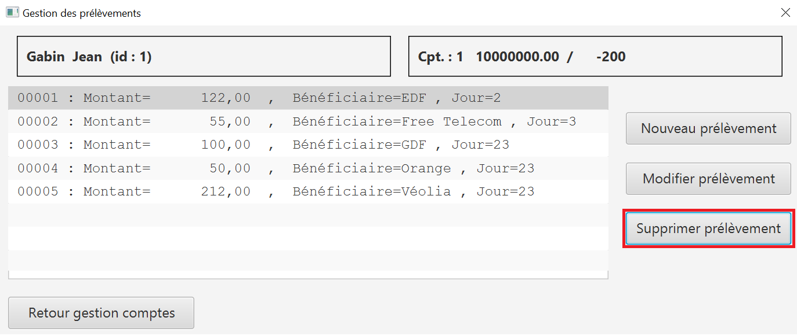
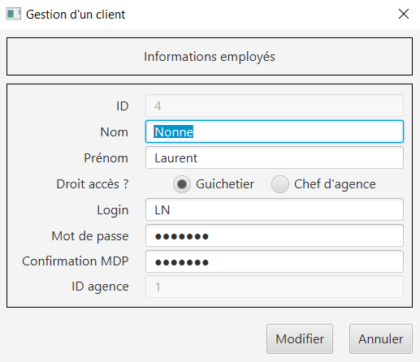

= Manuel d'utilisation de l'application
:toc:
:toc-title: Sommaire

Version de l'application : 1 +
Date : 20/04/2022 +
Equipe : Marcq Galatée - Monté Hugo - Tubia Eva +
Client : BankUniv +
Projet : Daily Bank + 

<<<

== 1. Description du Projet
=== a) Equipe

Conception/Développement : Marcq Galatée - Monté Hugo - Tubia Eva +

=== b) Contexte du projet

L'entreprise Daily Bank a besoin de restructurer leur réseau afin de s’intégrer dans une stratégie de différenciation. Elle possède plusieurs outils qui deviennent obsolètes et une première version d’application qui nécessite une refonte. Les besoins de la banque ont évolués, tout comme ceux de leurs clients, il faut donc développer plusieurs fonctinnalités pour répondre à ces nouveaux besoins.

=== c) Objectifs du projet

Le but est de générer le fichier executable de l'application (jar), la documentation technique, la documentation utilisateur ainsi que le cahier de tests correpondants à la version de l'application développée. Il y a deux types d’utilisateurs de l’application : le guichetier et le chef d’agence. Les guichetiers pourront créer de nouveaux clients et faire les opérations courantes (Create Read Update Delete). Les chefs d’agences pourront gérer les employés et les opérations exeptionnelles. L’application et les documentations seront découpées en plusieurs versions (3).

== 2. Lancer l'application
=== a) Prérequis

L'application DailyBankApp nécessite d'avoir installé Java 1.8. Si vous avez d'autres versions de Java installées, il faut lancer votre cmd en Java 1.8. +

=== b) Lancer le fichier jar
Si vous n'avez que la version 1.8 de Java, double cliquez sur le fichier DayliBank.jar pour lancer l'application. Si vous avez plusieurs versions de Java, ouvrez votre cmd dans le dossier où se trouve le fichier jar et éxecutez la commande suivante `java -jar DailyBank.jar` .

== 3. Utiliser l'application

=== a) Explications des rôles

Il existe deux rôles d'utilisateur différents : guichetier et chef d'agence. Les guichetiers ont le rôle le plus basique, alors que les chefs d'agence ont accès aux mêmes fonctionnalités que les guichetiers, avec de nouvelles fonctionnalités en supléments, auxquelles les guichetiers n'ont pas accès. Ainsi dans cette documentation, si vous avez le rôle de chef d'agence, vous pourrez accéder aux fonctionnalités de la partie `b) Guichetier` mais également à celles de la partie `c) Chef d'agence`.

=== b) Guichetier

==== Créditer un compte (Eva Tubia)

Pour créditer un compte, l'utilisateur doit ouvrir le menu des comptes du client, choisir le compte concerné dans la liste (cliquer dessus), cliquer sur "Voir opérations" puis "Enregistrer Crédit". 

image:img/bouton credit.png[]

Une nouvelle fenêtre permet à l'utilisateur de choisir le type de paiement (dépôt espèces ou chèque) et d'entrer le montant à créditer.

image:img/ihm crédit.png[]

Vous pouvez cliquer sur "Annuler crédit" à tout moment pour annuler l'opération. Une fois l'opération validée (cliquer sur "Effectuer Crédit"), si tout est correct dans la saisie du montant, il n'est pas possible de revenir en arrière l'opération est effectuée.

Pour que l'opération soit validée, le montant à créditer doit être posiitif.

==== Effectuer un virement (Eva Tubia)

Les virements de compte à compte se font pour des comptes d'une même agence. Pour effectuer un virement entre deux comptes, l'utilisateur doit ouvrir le menu des comptes du client, choisir le compte à débiter dans la liste (cliquer dessus), cliquer sur "Voir opérations" puis "Effectuer un virement". 

Une nouvelle fenêtre permet à l'utilisateur d'entrer le montant à virer ainsi que le numéro du compte destinataire.

Vous pouvez cliquer sur "Annuler virement" à tout moment pour annuler l'opération. Une fois l'opération validée (cliquer sur "Effectuer Virement"), si tout est correct dans la saisie du montant et du numéro de compte, il n'est pas possible de revenir en arrière l'opération est effectuée, le destinataire recevra l'argent immédiatement.

Pour que l'opération soit validée, le montant à virer doit être positif, le compte destinataire doit exister et ne doit pas être cloturé, et le compte qui effectue le virement doit être suffisamment approvisionné.

==== Créer un compte (Hugo Monté)

Pour créer un compte, le guichetier doit ouvrir le menu des comptes du client concerné.

Ensuite, il faut cliquer sur "Nouveau compte"

Enfin, il faut saisir les informations de ce nouveau compte. Une fois la création effectuée, ce compte apparaît dans la liste immédiatement (à moins qu'une erreur ait été mentionnée à la création).

Pour que ce compte soit valide, il faut que son solde de départ soit supérieur à 50€ et que son découvert soit positif ou nul. Dans le cas échéant, un message d'erreur personnalisé apparaîtra à l'écran.

==== Clôturer un compte (Hugo Monté)

Pour clôturer un compte, le guichetier doit ouvrir le menu des comptes du client concerné.

Ensuite, il doit sélectionner le compte concerné et enfin cliquer sur "Supprimer compte".

Le bouton est disponible si un compte est sélectionné, que ce dernier n'est pas déjà clôturé et que son solde est de 0€. Cela a pour effet de le définir comme clôturé (ces changements prennent effet immédiatement sur l'interface).

==== Générer un Relevé Mensuel (Hugo Monté)

Pour générer un relevé mensuel, le guichetier doit ouvrir le menu des comptes du client concerné.

Ensuite, il doit sélectionner le compte concerné et enfin cliquer sur "Générer relevé mensuel".

Le bouton est disponible si un compte est sélectionné.

Enfin, un menu s'ouvre, invitant à saisir la destination du relevé mensuel, le mois ainsi que l'année. Une fois ceci fait, il n'y a plus qu'à cliquer sur générer et le relevé aura été généré à l'endroit souahité.

==== Voir la liste des prélèvements automatiques (Eva Tubia)

Pour voir la liste des prélèvements l'utilisateur doit, à partir de la fenêtre de visualisation des comptes d'un client, sélectionner un compte non clôturé et cliquer sur "Voir prélèvements". 

La liste s'affiche directement et s'il n'y a pas de prélèvements enregistrés pour ce compte, la liste est vide.

==== Créer un nouveau prélèvement automatique (Eva Tubia)

Pour créer un nouveau prélèvement, une fois sur la page de visualisation des prélèvements d'un compte, il faut cliquer sur "Nouveau prélèvement". 

Une nouvelle page s'affiche où l'utilisateur peut remplir le bénéficiaire, c'est à dire celui qui prélève, le jour de prélèvement ainsi que le montant à prélever.

Vous pouvez cliquer sur "Annuler" à tout moment pour annuler la création. Une fois la création validée (cliquer sur "Créer"), si tout est correct dans la saisie des informations, le prélèvement est créé et sera visible dans la liste.

Pour que la création soit validée, aucun champ ne doit être vide, le montant à prélever doit être positif et le jour de prélèvement doit être compris entre 1 et 28.

==== Modifier un nouveau prélèvement automatique (Eva Tubia)

Pour modifier un prélèvement, une fois sur la page de visualisation des prélèvements d'un compte, il faut sélectionner un prélèvement dans la liste (cliquer dessus) puis cliquer sur "Modifier prélèvement". 

Une nouvelle page s'affiche où l'utilisateur peut modifier le jour de prélèvement ainsi que le montant à prélever.

Vous pouvez cliquer sur "Annuler" à tout moment pour annuler la modification. Une fois la modification validée (cliquer sur "Modifier"), si tout est correct dans la saisie des informations, le prélèvement est modifié et les changement seront visibles dans la liste.

Pour que la modification soit validée, aucun champ ne doit être vide, le montant à prélever doit être positif et le jour de prélèvement doit être compris entre 1 et 28.

==== Supprimer un prélèvement automatique (Eva Tubia)

Pour supprimer un prélèvement, une fois sur la page de visualisation des prélèvements d'un compte, il faut sélectionner un prélèvement dans la liste (cliquer dessus) puis cliquer sur "Supprimer prélèvement". 

Une page de confirmation s'affiche, vous pouvez cliquer sur "Annuler" pour annuler la suppression, ou cliquer sur "Ok" pour valider la suppression.

=== c) Chef d'agence

Le chef d'agence peut gérer les employés. Pour cela, après vous être connecté, allez dans le menu déroulant "Gestion", puis cliquez sur "Employés".

==== Voir la liste des employés (Galatée Marcq)

Dans la page principale de gestion des employés, le bouton "Rechercher" permet de rechercher des employés selon certains critères (ou aucun). +
Si le numéro d'emloyé est précisé et qu'il est correct, alors les champs "Nom" et "Prénom" seront ignorés pour la recherhce. L'employé ayant ce numéro d'identifiant sera alors affiché s'il existe. Cependant, si vous rentrez un numéro d'identifiant négatif, celui-ci ne sera pas pris en compte. +
Si la recherche s'effectue par Nom et/ou Prénom, alors vous pouvez renseigner seulement le début de ceux-ci, ou la totalité. +
Enfin, si aucun des champs n'est renseigné, la recherche s'effectuera sur tous les employés de votre agence. +
Le résultat de la recherche permet d'obtenir le numéro d'identifiant, le nom, le prénom, le rôle, le login et le numéro d'agence des employés. +

==== Créer un nouvel employé (Galatée Marcq)

Dans la page principale de gestion des employés, le bouton "Nouvel employé" permet de créer un nouvel employé. Vous obtiendrez ainsi la fenêtre suivante :

Dans cette fenêtre, tous les champs doivent être renseignés (nom, prénom, droits d'accès, login, mot de passe (avec confirmation)). Le numéro d'agence est le même que le vôtre (vous ne pouvez ajouter un employé que dans l'agence que vous gérez). +
Si vous souhaitez annuler l'ajout, cliquez sur le bouton "annuler". Sinon, cliquez sur "Ajouter" pour ajouter l'employé. Vous aurez la confirmation de l'ajout de celui-ci car il apparaîtra dans la fenêtre principale de gestion des employés. Si certaines informations sont incorrectes, vous pourrez les modifier à l'aide du bouton "Modifier les informations" (cf paragraphe suivant).

==== Modifier un employé (Galatée Marcq)

En tant que chef d'agence, vous pouvez également modifier les informations d'un employé. Dans la fenêtre principale de gestion des employés, le bouton "Modifier les informations" est désactivé : vous devez d'abord sélectionner un employé afin de modifier ses informations. Référrez-vous au paragraphe "Voir la liste des employés" afin de rechercher l'employé que vous souhaitez modifier. +
Une fois l'employé apparu dans la partie centrale de la fenêtre, sélectionner-le en cliquant dessus : le bouton "Modifier les informations" s'activera alors.

image:img/SélectionnerEmploye.png[]

Une fois que vous aurez cliqué sur le bouton "Modifier les informations", la fenêtre suivante apparaîtra :

Les anciennes informations de l'employé sont déjà remplies dans les champs, il vous suffit de modifier les attributs que vous souhaitez. Attention, si vous modifiez le mot de passe, n'oubliez pas de changer la confirmation de mot de passe également. Aucun champ ne doit être vide. +
Si vous souhaitez annuler la modification, cliquez sur le bouton "annuler". Sinon, cliquez sur "Modifier" pour modifier l'employé. Vous aurez la confirmation de la modification de celui-ci car les nouvelles informations sur l'employé seront directement mises à jour dans la fenêtre principale.

==== Supprimer un employé (Galatée Marcq)

Vous pouvez également supprimer un employé. Dans la fenêtre principale de gestion des employés, le bouton "Supprimer l'employé" est désactivé : vous devez d'abord sélectionner un employé afin de pouvoir le supprimer. Référrez-vous au paragraphe "Voir la liste des employés" afin de rechercher l'employé que vous souhaitez modifier. +
Une fois l'employé apparu dans la partie centrale de la fenêtre, sélectionner-le en cliquant dessus : le bouton "Supprimer l'employé" s'activera alors.

image:img/SélectionnerEmploye.png[]

Une fois que vous aurez cliqué sur le bouton "Supprimer l'employé", une fenêtre de confirmation apparaîtra :

 

Vérifiez bien le numéro du compte de l'employé avant de confirmer, car la suppression est irréversible. Si vous vous êtes trompé d'employé, ou si vous avez des doutes, veuillez cliquer sur "Annuler", et aucun changement ne sera pris en compte. Si vous êtes bien sûr de vouloir supprimer l'employé, cliquer alors sur "OK", et l'employé sera supprimé.

==== Réaliser un débit exceptionnel (Galatée Marcq)

Dans la fenêtre de gestion des opérations d'un compte, vous trouverez le bouton "Enregistrer Débit Exceptionnel". Ce bouton sera grisé si vous êtes connecté en temps que guichetier.

Une fois le bouton cliqué, une nouvelle fenêtre apparait. Vous devez remplir le montant, ainsi que choisir le type d'opération (Retrait Espèces ou Retrait Carte Bleue).

Si le montant indiqué est inférieur à 0 ou ne contient pas des chiffres, alors il sera indiqué en rouge et vous ne pourrez pas valider le débit exceptionnel. 

Pour valider le débit exceptionnel, cliquez sur le bouton "Effectuer Débit Exceptionnel", sinon cliquez sur "Annuler débit exceptionnel" pour annuler.
